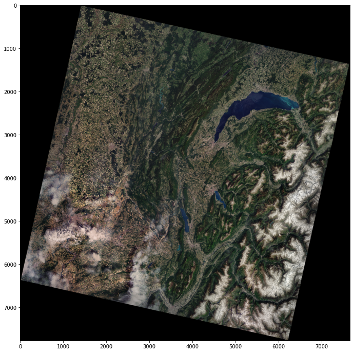
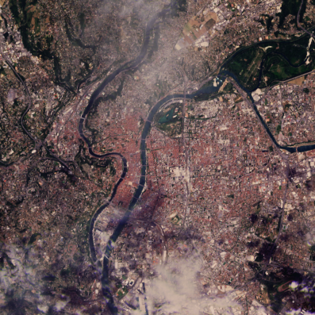
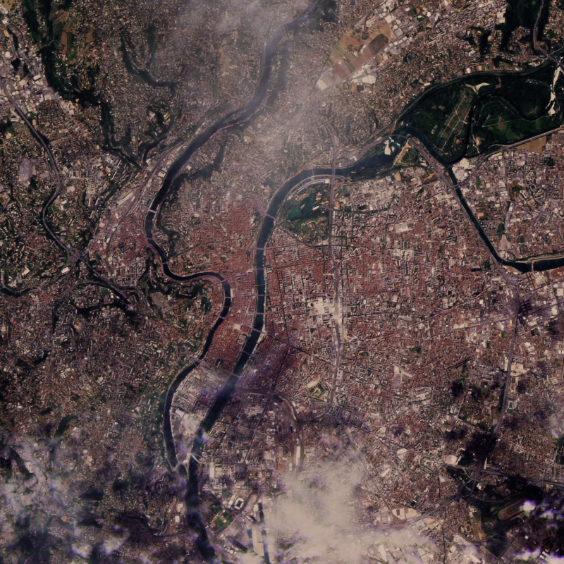
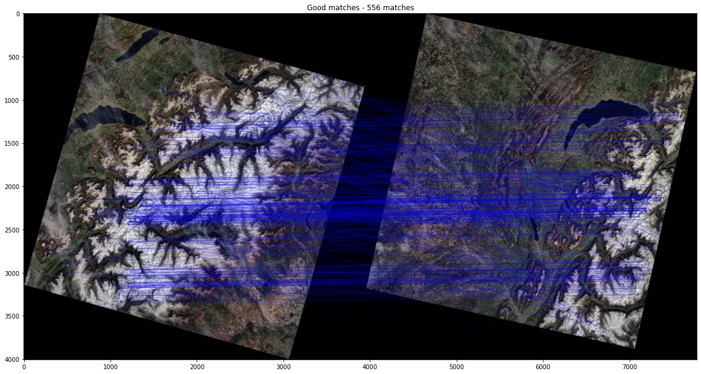

# Satellite imagery treatment pipeline : band combination, pansharpening & mosaicing

🇫🇷 **Version française disponible** [**ici**](README_FR.md).

## Under what circumstances is it useful

### Band combination

A satellite captures different bands, each reserved for specific wavelengths. They can be combined in different ways to obtain different information. You can see examples of useful combinations by following [this link](https://gisgeography.com/landsat-8-bands-combinations/).

For this project, our goal is to recover an image whose colors are close to natural colors. We will therefore use the red, green, blue and panchromatic (black and white) bands.

The image obtained by simply combining the R, G and B channels is very dark. We use a CLAHE histogram equalization to lighten it by increasing the contrasts.

### Pansharpening

The **panchromatic** images are obtained from the recording of radiation in a single wavelength interval located in the visible range, i.e. between 0.4 and 0.7 m. The data being acquired in a single channel, only black and white images can be obtained (if the image is coded on 8 bits, it will be visualizable in 255 levels of gray). Although less rich from the point of view of the **spectral resolution**, the panchromatic image offers a **spatial resolution** more important.

Through the combination of the spatial resolution of a detailed panchromatic (grayscale) image with the color information of a less detailed multispectral image, we obtain a colored image with very high resolution.

### Mosaicing

To obtain images of a large area, it is necessary to link several images captured by the satellite. This is the purpose of mosaicing, following the same principle as the creation of a panorama.

Landsat 8 coverage of France.

## Usage

1. Launch `./get_data.sh` to get the satellite bands needed to use the notebooks. **/!\ ~1.3 Gb of data/!**
2. In `./notebooks/`, run the following notebooks :
   1. `band-combination.ipynb` on data from Lyon and Lausanne.
   2. `hsv-pansharpening-satellite.ipynb` on data from Lyon and Lausanne.
   3. `mosaicing-satellite.ipynb` to get the final result.

## Results

### Band combination

| Avant                                                                | Après                                                                |
| -------------------------------------------------------------------- | --------------------------------------------------------------------- |
|  |  |

### Pansharpening

| Avant                                                | Après                                                       |
| ---------------------------------------------------- | ------------------------------------------------------------ |
|  |  |

### Mosaicing

## Contributors

**Adrien ANTON LUDWIG** - IMAGE 2023

**Adèle PLUQUET** - IMAGE 2023

## Sources

- [The 4 types of resolution in satellites (spatial, temporal, radiometric and spectral)](https://eo.belspo.be/fr/actualites/resolution-spectrale)
- [Spectral and spatial resolutions](https://eo.belspo.be/fr/les-images-de-teledetection)
- [Usefulness of pansharpening](https://eos.com/make-an-analysis/panchromatic/)
- [Landsat 8](https://www.usgs.gov/landsat-missions/landsat-8) & [Landsat 9](https://www.usgs.gov/landsat-missions/landsat-9) (specificities)
- [Free access site to satellite images](https://earthexplorer.usgs.gov/) & [Video explaining its use](https://www.youtube.com/watch?v=GmwBJT3ioao&ab_channel=KlasKarlsson)
- [Guide to the different images available (different satellites) and where to find them](https://ids.equipex-geosud.fr/web/guest/images-landsat-8)
- [Explanation pansharpening HSV (video)](https://www.youtube.com/watch?v=-139c169pKQ&ab_channel=ThalesSehnK%C3%B6rting)
- [Some pansharpening algorithms explained](https://pro.arcgis.com/fr/pro-app/latest/help/analysis/raster-functions/fundamentals-of-pan-sharpening-pro.htm)
- Papers comparing different pansharpening methods :

  - https://www.ipol.im/pub/art/2014/98/article_lr.pdf
  - https://hal-mines-paristech.archives-ouvertes.fr/hal-01024987/document  & [corresponding video](https://www.youtube.com/watch?v=9TgU6migUy0&ab_channel=MITEducation)
- [Retrieve satellite data with Python (datacube library)](https://docs.dea.ga.gov.au/notebooks/Frequently_used_code/Pan_sharpening_Brovey.html)
- [Smoothing of colors during mosaicing](https://hal.archives-ouvertes.fr/hal-01373314/file/cresson2015.pdf)

## Languages and tools

